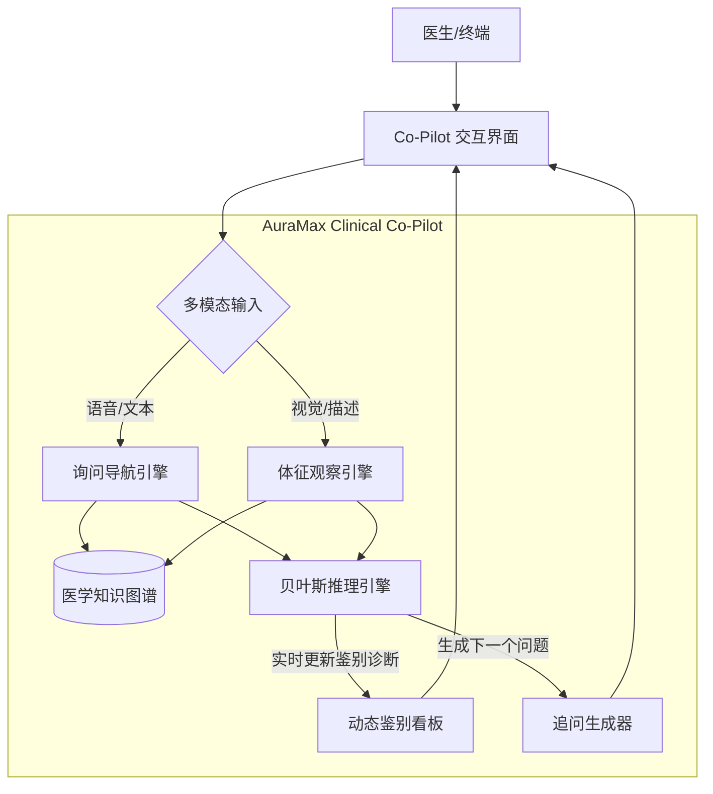

# AuraMax Clinical Co-Pilot™ 架构设计文档

## 1. 愿景与痛点 (Vision & Problem)

**痛点 (Pain Point)**：
现代医疗过度依赖定量数据（化验、影像），忽视了定性数据（病史、观察、沟通）。医生缺乏询问技巧（Anamnesis Skills）和敏锐的观察力（Observational Skills），导致"只见树木不见森林"，错失鉴别诊断的关键线索。

**愿景 (Vision)**：
建立 **AuraMax Clinical Co-Pilot** —— 一个实时的、人在回路（Human-in-the-Loop）的问诊导航系统。它不是取代医生，而是作为"第二大脑"，根据医生输入的初步症状，动态生成鉴别诊断路径，提示医生观察患者体征，并实时推理可能的疾病概率。

---

## 2. 核心系统架构 (System Architecture)

系统由四大核心引擎组成：

### 2.1 询问导航引擎 (Dynamic Interview Engine)
*   **功能**：不仅仅是静态问卷，而是基于 **HPI (History of Present Illness)** 的动态决策树。
*   **技术**：基于 LLM (Chain-of-Thought) + 规则引擎 (Rules Engine)。
*   **逻辑流**：
    1.  医生输入主诉（如"咳嗽"）。
    2.  引擎检索"咳嗽"相关的鉴别诊断（肺炎、哮喘、GERD、心衰等）。
    3.  生成关键鉴别问题（"有痰吗？" "夜间加重吗？"）。
    4.  根据回答动态修剪诊断树（如回答"无痰"，降低细菌性肺炎权重，提高哮喘/病毒权重）。

### 2.2 体征观察引擎 (Observation Engine)
*   **功能**：辅助医生捕捉非语言线索。
*   **实现方式**：
    *   **Level 1 (Checklist)**：UI 侧边栏提供快速点击的观察标签（面色潮红、呼吸急促、杵状指、大汗淋漓）。AI 会根据当前疑似疾病高亮关键观察点。
    *   **Level 2 (Computer Vision - Future)**：利用摄像头实时分析患者面部特征（如黄疸、贫血貌）。
*   **示例**：
    *   主诉"腹痛" -> AI 提示观察："患者是否蜷缩体位？（胰腺炎）" "是否有黄疸？（胆道疾病）"。

### 2.3 贝叶斯推理引擎 (Probabilistic Inference)
*   **功能**：实时计算疾病的后验概率 (Posterior Probability)。
*   **算法**：$P(Disease|Symptom) = \frac{P(Symptom|Disease) \times P(Disease)}{P(Symptom)}$
*   **输出**：在界面展示 Top 5 疑似疾病及其概率条（Likelihood Bar）。

---

## 3. 功能交互设计 (UX Design)

### 3.1 界面布局 (The "Cockpit")

*   **左侧：实时对话流 (The Dialogue)**
    *   类似于 Chat 界面，但结合了结构化表单。
    *   医生输入："咳嗽 3天"
    *   AI 自动解析：`Symptom: Cough`, `Duration: 3 days`

*   **中间：智能提示区 (The Prompter)**
    *   **建议追问 (Suggested Questions)**：
        *   "痰液颜色？(Color of Sputum)" [Yellow] [Green] [White] [None]
        *   "是否有发热？(Fever)" [Yes] [No]
        *   "是否吸烟？(Smoking)" [Yes] [No]
    *   **观察提示 (Observation Cues)**：
        *   "请观察：指甲是否有杵状指？（长期缺氧）"
        *   "请观察：颈静脉是否怒张？（右心衰）"

*   **右侧：动态诊断板 (Evidence Board)**
    *   **Differential Diagnosis (DDx)**：
        1.  🫁 急性支气管炎 (45%)
        2.  🦠 社区获得性肺炎 (30%)
        3.  ❤️ 左心衰竭 (5%)
    *   **Missing Evidence**：
        *   "需要排除心衰：请询问是否有夜间阵发性呼吸困难。"

---

## 4. 技术实现路线图 (Implementation Roadmap)

### Phase 1: 结构化问诊 Demo (当前目标)
*   **目标**：实现针对 3-5 个常见主诉（咳嗽、腹痛、头痛）的结构化问诊逻辑。
*   **前端**：`ConsultationChat` 组件，支持快捷回复（Chips）。
*   **后端**：
    *   `InterviewService`: 用 LLM 生成追问策略。
    *   `DiagnosisService`: 简单的加权评分算法。

### Phase 2: 多模态观察
*   **目标**：集成简单的视觉观察 Checklist。
*   **功能**：在问诊过程中，AI 弹出"观察任务"卡片，医生勾选确认。

### Phase 3: 深度集成与 FHIR
*   **目标**：将问诊结果生成为结构化的 FHIR `Condition` 和 `Observation` 资源，存入 EHR。

## 5. 示例剧本 (Use Case Script)

**场景**：患者男，55岁，主诉咳嗽。

1.  **Doctor**: 输入 "咳嗽"
2.  **Co-Pilot**:
    *   *Think*: Age 55, Cough. Differential: COPD, Cancer, Pneumonia, Heart Failure.
    *   *Prompt*: "请询问：咳嗽持续时间？是干咳还是湿咳？"
3.  **Doctor**: 询问并点击 UI 选项：`3 days`, `Wet Cough`, `White Sputum`.
4.  **Co-Pilot**:
    *   *Logic*: Acute timeline + White sputum = Viral likely. But exclude HF.
    *   *Observation Task*: ⚠️ "请观察患者呼吸频率，是否有'三凹征'？面色是否潮红？"
5.  **Doctor**: 观察发现"面色潮红"，"呼吸稍促"。勾选 `Flushed Face`, `Tachypnea`.
6.  **Co-Pilot**:
    *   *Update DDx*: 肺炎风险上升 (60%)。
    *   *Prompt*: "建议测量体温。请询问是否有胸痛？"

---

## 6. 下一步行动 (Action Plan)

为实现此系统，建议在 AuraMax 中新增以下模块：

1.  **Feature**: `auramax-reasoning` 新增 `ConsultationAgent`。
2.  **UI**: 新增 `/dashboard/doctor/consultation` 页面。
3.  **Skill**: 引入 `medical-interview-framework` (基于 Calgary-Cambridge 指南)。

此设计将彻底改变医生"只看单子不看人"的现状，回归医疗本质。
